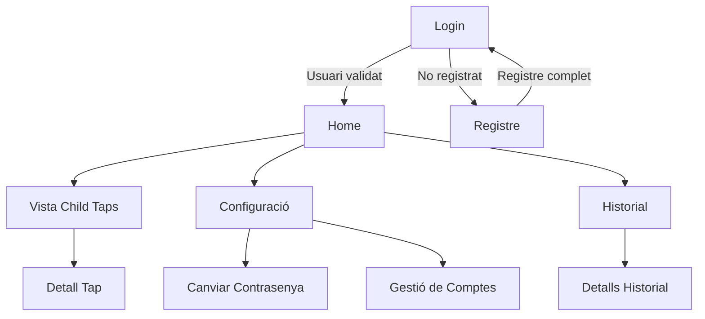
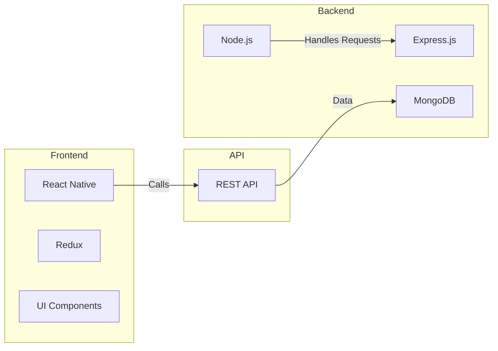
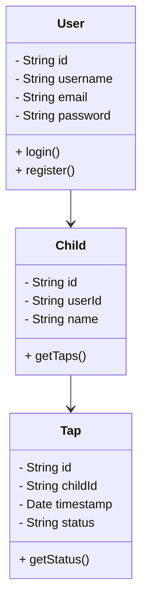

# Prototip 2 - Wireframes & Mockups

## Introducció
En el disseny d'aplicacions, els **wireframes** i **mockups** són elements essencials en el procés de prototipatge i definició de la interfície d’usuari (UI). A continuació es presenta el flux de navegació de l'App **TapatApp**.

---

## 1. Wireframes: Flux de Navegació

---

## 2. Descripció de les Vistes

### Vista de Login
- **Descripció**: Pantalla de Login on l'usuari es validarà de forma segura.
- **Informació d'Entrada**: Username o email, Password.
- **Informació que necessita la Vista**: None.

### Vista de Registre
- **Descripció**: Formulari de registre d'usuari.
- **Informació d'Entrada**: Username, password, email.
- **Informació que necessita la Vista**: None.

### Vista Home
- **Descripció**: Pantalla principal de l'usuari amb accés a les funcionalitats principals.
- **Informació d'Entrada**: None.
- **Informació que necessita la Vista**: Dades de l’usuari.

### Vista Child Taps
- **Descripció**: Vista del Child que té assignat l’Usuari amb els registres d’estat del pegat.
- **Informació d'Entrada**: None.
- **Informació que necessita la Vista**: User, Child i Taps.

### Vista Configuració
- **Descripció**: Permet gestionar configuracions de l’usuari.
- **Informació d'Entrada**: Opcions de configuració.
- **Informació que necessita la Vista**: Dades d’usuari.

### Vista Historial
- **Descripció**: Mostra els registres previs d’ús.
- **Informació d'Entrada**: None.
- **Informació que necessita la Vista**: Registres d’ús.

### Vista Detall Tap
- **Descripció**: Mostra informació detallada d’un Tap específic.
- **Informació d'Entrada**: Selecció del Tap.
- **Informació que necessita la Vista**: Dades del Tap.

### Vista Canviar Contrasenya
- **Descripció**: Permet a l’usuari modificar la seva contrasenya.
- **Informació d'Entrada**: Contrasenya actual, nova contrasenya.
- **Informació que necessita la Vista**: Credencials de l’usuari.

### Vista Gestió de Comptes
- **Descripció**: Permet a l’usuari gestionar els seus comptes i dades.
- **Informació d'Entrada**: Edició de dades.
- **Informació que necessita la Vista**: Dades de l’usuari.

### Vista Detalls Historial
- **Descripció**: Mostra informació detallada d’un registre d’historial.
- **Informació d'Entrada**: Selecció de registre.
- **Informació que necessita la Vista**: Dades del registre.

---

## 3. Diagrama d'Arquitectura

---

## 4. Diagrama de Classes (Backend i Frontend)

---

## 5. Implementació
1. **Implementar les vistes**:
   - Login
   - Child Taps
2. **Desenvolupar API Backend** per la gestió de **Users** i **Taps**.
3. **Integració Frontend** amb Backend via **REST API**.
4. **Publicació del Prototip 2** a GitHub i link al README.md.

Aquest document defineix l'arquitectura i el flux de navegació del **Prototip 2** de l'App **TapatApp**.

